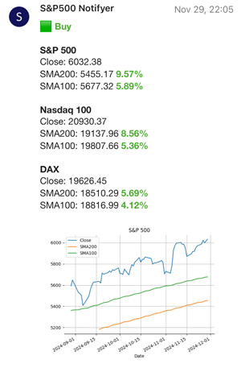

# S&P 500 Notifyer

Simple script which generates a report with buy and sell signals for the 200D SMA strategy on the 2x leveraged S&P 500. Stock market data is retrieved from [Yahoo Finance](https://finance.yahoo.com). The report is sent via [Pushover](https://pushover.net/). The script itself does not do any scheduling and must be executed via something like CRON.



## Usage

The simplest option is to run the script via docker.

Create a `config.ini` file containing the credentials (token, user) for pushover:
```ini
[pushover]
token = ***
user = ***
```
Then execute the script in docker:
```bash
docker run --rm -v "$(pwd)"/config.ini:/config.ini:ro ghcr.io/schaenzer/sp500notifyer:main --config /config.ini
```

## Contributing

Pull requests are welcome. For major changes, please open an issue first
to discuss what you would like to change.

## License

[MIT License](LICENSE)
